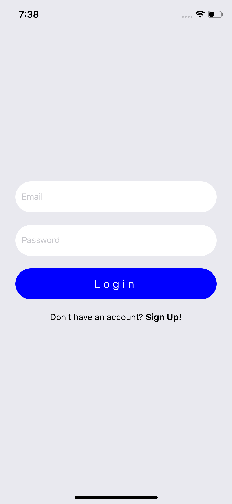
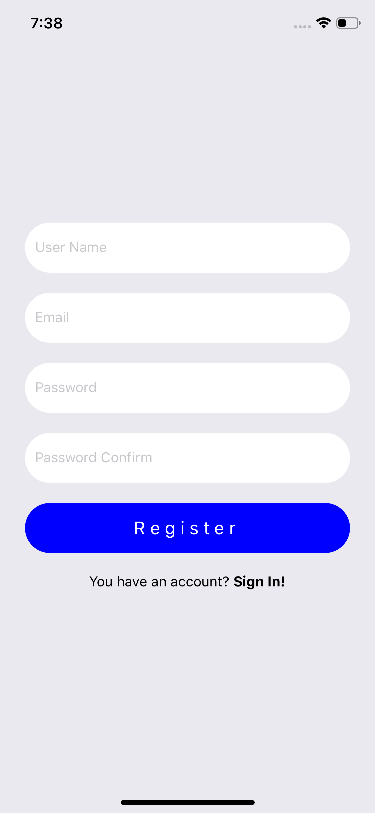
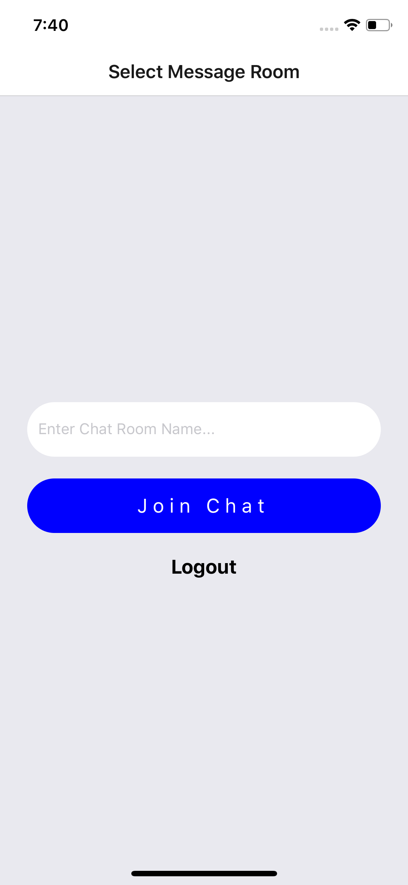
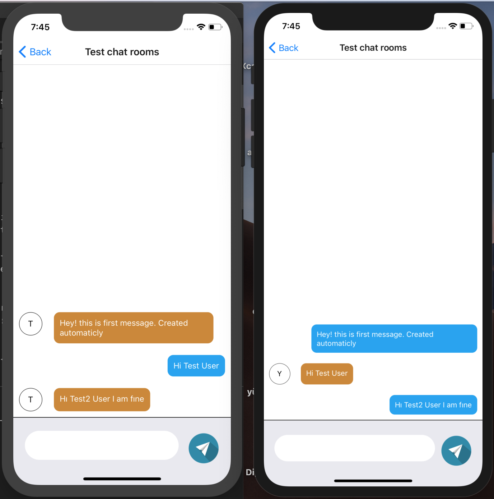

# Messaging App

  

## Instalition
- 1- clone app
- 2- npm install in terminal project directory
- 3- react-native link
- For IOS => go to /ios directory and run  => pod install

### Usage Libraries
* [React Native Router flux](https://github.com/aksonov/react-native-router-flux)
* [React Redux](https://github.com/reduxjs/react-redux)
* [Redux](https://github.com/reduxjs/redux)
* [redux-thunk](https://github.com/reduxjs/redux-thunk)
* [react-native-firebase](https://github.com/invertase/react-native-firebase)

